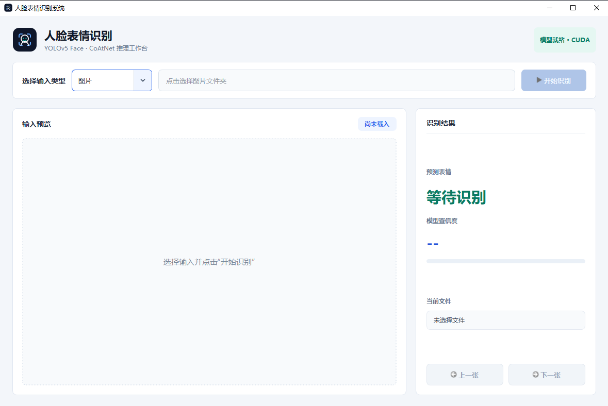
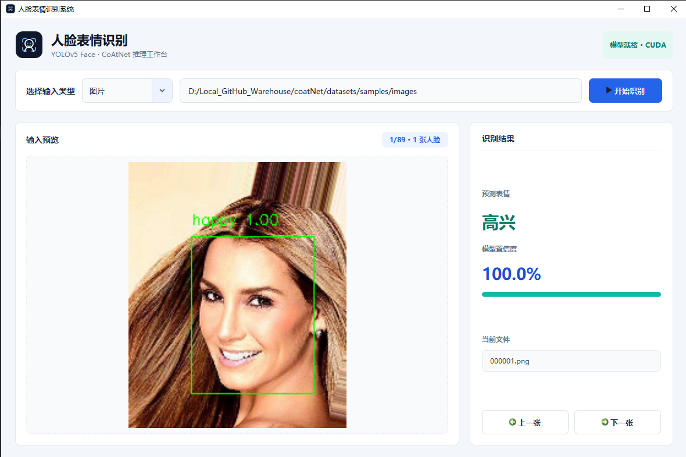
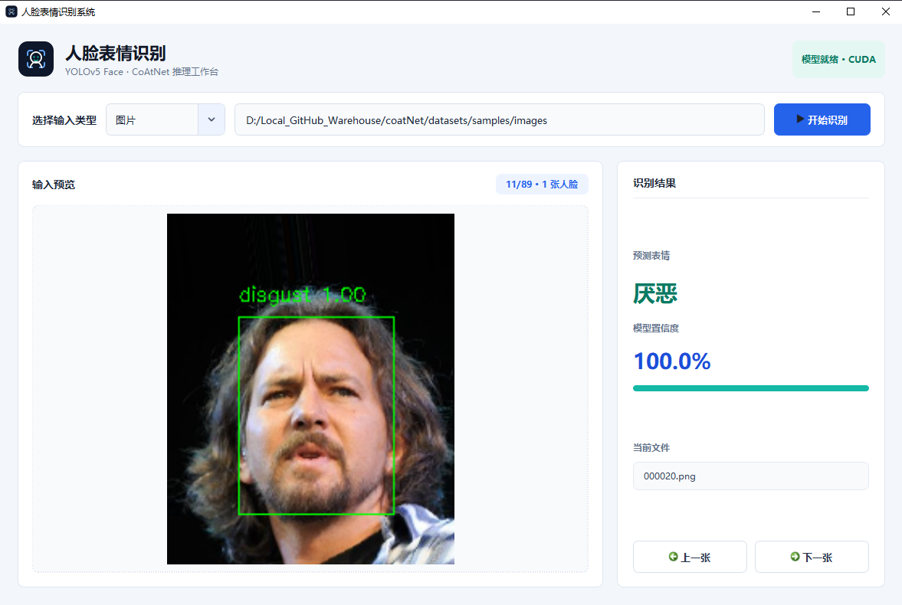
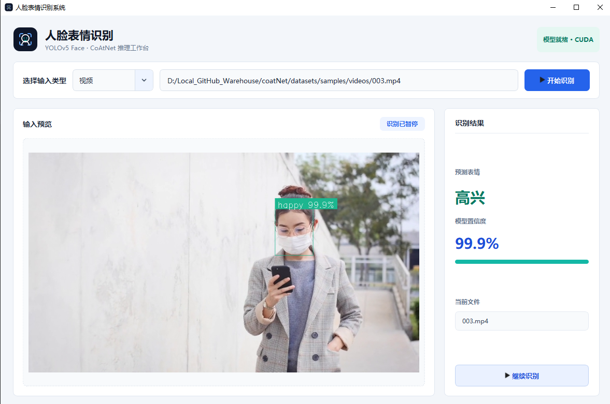

# 人脸表情识别系统

本项目使用 YOLOv5-face 检测人脸，再使用 CoAtNet 对 7 类表情进行分类。项目提供桌面应用、单张图片推理、两套训练流程、数据集统计和混淆矩阵工具。

## 界面展示

<p align="center">
  
  
  <br>
  
  
</p>

表情类别为：

```text
angry, disgust, fear, happy, neutral, sad, surprise
```

## 快速开始

项目命令需要在仓库根目录执行：

```powershell
python -m venv venv
venv\Scripts\Activate.ps1
pip install -r requirements.txt

python -m tools.check_model
python -m app
```

`tools.check_model` 会检查 Python、PyTorch、CUDA、数据目录、YOLO 权重和 CoAtNet 权重。如果环境完整，会显示全部为 `OK`。

## 项目结构

```text
.
├── app/                          # PyQt5 桌面应用
│   ├── assets/                   # 应用图标
│   ├── generated_ui.py           # 由 gui.ui 生成
│   ├── main_window.py            # 图片、视频、摄像头业务逻辑
│   ├── theme.py                  # 界面主题
│   └── dialogs.py                # 提示弹窗
├── data_loader/                  # 数据集加载、增强与清洗
├── datasets/                     # 本地数据，默认不提交 Git
│   ├── emotion-domestic/         # train/ 和 val/ 图像文件夹数据集
│   ├── fer2013/
│   └── samples/                  # 测试图片与视频
├── inference/                    # 模型配置与单图推理
├── models/                       # CoAtNet 和 YOLOv5-face
├── reports/                      # 分析报告和图表
├── runs/                         # 训练日志与权重，默认不提交 Git
│   ├── baseline/
│   └── dynamic/
├── tools/                        # 检查、统计、评估工具
├── training/                     # 两套训练入口和公共训练逻辑
├── config.py                     # 统一路径配置
└── requirements.txt
```

## 启动桌面应用

```powershell
python -m app
```

应用默认加载：

```text
models/yolov5_face/weights/yolov5n-face.pt
runs/dynamic/weights/best_model.pth
```

可识别人脸图片文件夹、视频文件和摄像头输入。

## 单张图片推理

```powershell
python -m inference.predictor --image-path datasets/samples/images/000001.png
```

不传 `--image-path` 时，默认使用 `datasets/samples/images/000001.png`。

## 训练模型

### 基础训练

默认使用 `datasets/emotion-domestic`，结果保存到 `runs/baseline`：

```powershell
python -m training.train --epochs 10 --batch-size 8
```

### 动态增强训练

默认使用类别权重和动态数据增强，结果保存到 `runs/dynamic`：

```powershell
python -m training.train_dynamic --epochs 150 --batch-size 64
```

显式指定数据和输出目录：

```powershell
python -m training.train_dynamic `
  --data-path datasets/emotion-domestic `
  --output runs/dynamic `
  --epochs 150 `
  --batch-size 64
```

训练产物结构：

```text
runs/<run-name>/
├── logs/
└── weights/
    ├── best_model.pth
    └── ckpt_epoch_*.pth
```

## 数据集工具

查看 emotion-domestic 的类别数量：

```powershell
python -m tools.inspect_dataset
```

指定其他图像文件夹数据集：

```powershell
python -m tools.inspect_dataset --dataset-dir datasets/emotion-domestic
```

数据集需要满足以下格式：

```text
datasets/emotion-domestic/
├── train/
│   ├── angry/
│   ├── disgust/
│   ├── fear/
│   ├── happy/
│   ├── neutral/
│   ├── sad/
│   └── surprise/
└── val/
    └── ...
```

FER2013 CSV 默认路径为 `datasets/fer2013/fer2013.csv`。

## 混淆矩阵

生成 emotion-domestic 混淆矩阵：

```powershell
python -m tools.confusion_matrix --dataset emotion-domestic
```

生成 FER2013 混淆矩阵：

```powershell
python -m tools.confusion_matrix --dataset fer2013
```

报告默认保存到 `reports/confusion_matrix/`。如需切换权重：

```powershell
python -m tools.confusion_matrix `
  --dataset emotion-domestic `
  --checkpoint runs/dynamic/weights/best_model.pth
```

## 权重说明

仓库保留较小的 YOLOv5-face 检测权重：

```text
models/yolov5_face/weights/yolov5n-face.pt
```

CoAtNet 表情分类权重较大，本地默认保留下面的文件，但不提交 Git：

```text
runs/baseline/weights/best_model.pth
runs/baseline/weights/old_best_model.pth
runs/dynamic/weights/best_model.pth
```

应用和单图推理默认使用 `runs/dynamic/weights/best_model.pth`。其他权重可通过推理配置或命令行参数指定。

## 路径配置

所有主要路径集中在 `config.py`：

- `datasets/`：数据集和测试样例。
- `runs/`：训练日志和权重。
- `reports/`：生成的报告。
- `models/yolov5_face/weights/`：YOLOv5-face 权重。

移动数据或训练产物后，优先修改 `config.py`，不需要在多个脚本中分别改路径。

## 依赖

完整依赖见 `requirements.txt`，核心版本为：

- Python 3.10 或 3.11 推荐，当前项目也可在 Python 3.12 下通过导入和推理检查。
- PyTorch 2.3.0
- torchvision 0.18.0
- timm 0.9.16
- OpenCV、PyQt5、NumPy、Pandas
- scikit-learn、seaborn、matplotlib
- TensorBoard

如果没有 NVIDIA GPU，项目会自动使用 CPU。CPU 可以运行推理和小批量测试，但完整训练速度会明显变慢。
